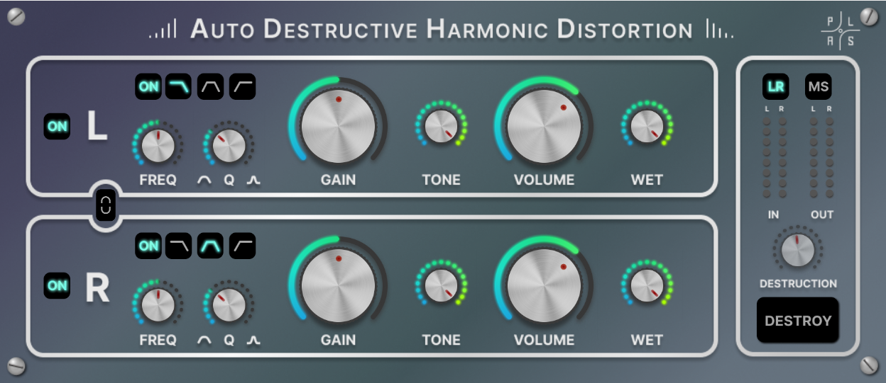

# **Auto Destrctive Harmonic Distortion**

 <em>Group 5 PLAS</em>

- [**Auto Destrctive Harmonic Distortion**](#auto-destrctive-harmonic-distortion)
  - [Project Description](#project-description)
  - [Getting Started](#getting-started)
  - [Usage](#usage)
  - [Folder Structure](#folder-structure)
  - [Notes](#notes)
  - [Components](#components)

## Project Description

Project developed in [Juce](https://juce.com/) framework for the course of Computer Music Languages and Systems 
<!--
Granulands consists of a granular synthesizer that plays four different **Foley** sounds, all the generated through the <em>Granular Synthesis</em> technique. It also allows the user to manipulate their characteristics and to place them around the stereo spectrum.
A complete description of the development of the system can be found in the [report](https://github.com/polimi-cmls-22/group5-HW-SC-PLAS/blob/main/report1.pdf)
 -->
<em>Auto Destructive Harmonic Distortion</em> allows the user to process the sound in a complete way. The plugin is composed of two channels that give the possibility to the user of a Left-Right or Mid-side processing. Every channel has both a input filter that allows three types of prefiltering (lowpass, bandpass, highpass), and a filter positioned after distortion. Moreover the plugin offers a true-peak level meter to monitor input-output levels.  
A complete description of the development of the system can be found in the [report](https://github.com/polimi-cmls-22/group5-HW-SC-PLAS/blob/main/report1.pdf)

## Getting Started

In order to build the plugin on your own Computer:

https://user-images.githubusercontent.com/62107154/167499653-6f4649ae-b2e4-4467-b284-d9a3775c0927.mp4


1. Download the git repository
2. Download the [Juce source code](https://juce.com/get-juce)
3. Open a new Projucer file. 
4. Add the <em>juce_dsp</em> module to the module list
5. Choose the preferred IDE used to build the plugin.ù
6. Run the juce project in order to open it in the IDE
7. Build the plugin in the IDE
8. Import it in the plugins folder of your DAW
9. TRY IT!! 


## Usage


1. The <em>GUI</em> is divided in two channelstrips, one for each channel. Each channel-strip contains some controls: 
  
    

   
   * The ON-Button allows to turn ON or turn OFF the single channel
   * 
   

   * The Filter-ON button allows to turn ON or OFF the single input-filter.
   
   * The Filter-switch allows to select type of input-filter between Lowpass, Bandpass, Highpass.
   
   * The Frequency-Dial allows to change the the cut-off or central frequency of the filter. 
   
   * The Q-Dial allows to change the the cut-off or central frequency of the filter. 
   * 
   


   * The gain Dial allows to enhance the input gain in order to make the distortion stronger.
   * 

   * The Tone Dial allows to control the tone filter applied after distortion.
   * 
  
   * The Volume Dial allows to control the volume applied at the end of the channel processing.
   * 
  
   * The WET knob allows to blend wet and dry signal to 
   * 

2. The master section allows to control the parameters of the master channel and all the sounds generated.

   

   * The **PLAYALL** button allows to play all the sounds together and to stop some or all them if they are playing.
   * 

   * The reverb controls allow the user to modify the parameters of the reverb effect applied to the master channel
   * 
   * The Master Volume section allows to visualize the output level of the main signal
   * 

3. The panner section is composed of two elements: 
   * A little panner view in the main window allows  to visualize the changes made on the sound spatial position, and allows to open the main panner window if clicked. 
   * 
   * The main panner window allows the user to visualize the spatial position of the sounds and to move them inside the stereo spectrum by dragging them on the window.
   * 

4. The little button on the upper left corner allows the user to set some backgrounds to better visualize the type sounds playing

## Folder Structure

The project repository contains one supercollider file that contains the code to run the synth and various folders:
* "buffer" contains the audio file used as source for granular synthesis. 
* "backgrounds" contains the images used as optional backgrounds for the GUI.
* "pointers" contains the images used as pointers for the panner window.
* "images" contains all the images used in the report and in the README

```
group5-HW-SC-PLAS
 ┣ backgrounds
 ┃ ┣ Fire_crop.png
 ┃ ┣ Shrek_crop.png
 ┃ ┣ Walk_crop.png
 ┃ ┗ Wolf_crop.png
 ┣ buffer
 ┃ ┗ 1.wav
 ┣ images
 ┃ ┣ attenuation-graph.png
 ┃ ┣ Fire signal flow.png
 ┃ ┣ fireGUIEx.PNG
 ┃ ┣ FireParams.PNG
 ┃ ┣ frogs signal flow.png
 ┃ ┣ Granulands.png
 ┃ ┣ littlePanner.PNG
 ┃ ┣ main patch diagram.png
 ┃ ┣ masterSection.PNG
 ┃ ┣ masterVolume.PNG
 ┃ ┣ oscilloscope.PNG
 ┃ ┣ pan&distance.PNG
 ┃ ┣ Panner.png
 ┃ ┣ playAllBTN.PNG
 ┃ ┣ playButton.PNG
 ┃ ┣ reverbSec.PNG
 ┃ ┣ steps signal flow.png
 ┃ ┗ wolf signal flow.png
 ┣ pointers
 ┃ ┣ cricket.png
 ┃ ┣ fire.png
 ┃ ┣ steps.png
 ┃ ┗ wolf.png
 ┣ LICENSE
 ┣ PLASgui.scd
 ┣ readme.md
 ┗ report1.pdf
```


## Notes

* The system has been built and tested on Windows 10 OS machines and using it on MAC OS could lead to minor GUI problems. It is suggested to close the main window and restart the system in order to fix them

## Components 
Alberto Doimo (alberto.doimo@mail.polimi.it) </p>
Paolo Ostan (paolo.ostan@mail.polimi.it) </p>
Stefano Donà (stefano2.dona@mail.polimi.it) </p>
Lorenzo Curcio (lorenzo.curcio@mail.polimi.it) </p>
