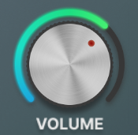
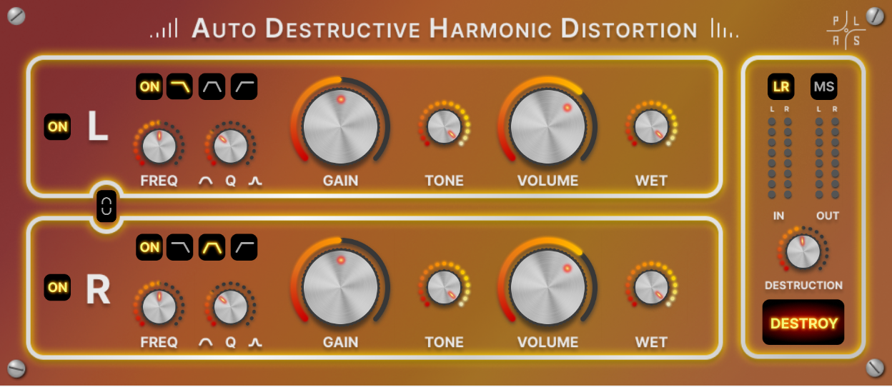

# **Auto Destructive Harmonic Distortion**

 <em>Group 5 PLAS</em>

- [**Auto Destructive Harmonic Distortion**](#auto-destructive-harmonic-distortion)
  - [Project Description](#project-description)
  - [Getting Started](#getting-started)
  - [Usage](#usage)
  - [Distortion curves](#distortion-curves)
  - [Folder Structure](#folder-structure)
  - [Notes](#notes)
  - [Components](#components)

## Project Description

Project developed in [Juce](https://juce.com/) framework for the course of Computer Music Languages and Systems 
<!--
Granulands consists of a granular synthesizer that plays four different **Foley** sounds, all the generated through the <em>Granular Synthesis</em> technique. It also allows the user to manipulate their characteristics and to place them around the stereo spectrum.
A complete description of the development of the system can be found in the [report](https://github.com/polimi-cmls-22/group5-HW-SC-PLAS/blob/main/report1.pdf)
 -->
<em>Auto Destructive Harmonic Distortion</em> allows the user to process the sound in a complete way. The plugin is composed of two channels that give the possibility to the user of a Left-Right or Mid-side processing. Every channel has both an input filter that allows three types of prefiltering (lowpass, bandpass, highpass), and a filter positioned after distortion. Moreover the plugin offers a true-peak level meter to monitor input-output levels.  
A complete description of the development of the system can be found in the [report](https://github.com/polimi-cmls-22/group5-HW-SC-PLAS/blob/main/report1.pdf)

## Getting Started

In order to build the plugin on your own Computer:

1. Download the git repository
2. Download the [Juce source code](https://juce.com/get-juce)
3. Open a new Projucer file. 
4. Add the <em>juce_dsp</em> module to the module list
5. Choose the preferred IDE used to build the plugin
6. Run the juce project in order to open it in the IDE
7. Build the plugin in the IDE
8. Import it in the plugins folder of your DAW
9. TRY IT!! 

## Usage

1. The <em>GUI</em> is divided in two channelstrips, one for each channel. Each channel-strip contains some controls: 
  
    

   
   * The ON-Button allows to turn ON or turn OFF the single channel
   * 
   

   * The Filter-ON button allows to turn ON or OFF the single input-filter.
   
   * The Filter-switch allows to select type of input-filter between Lowpass, Bandpass, Highpass.
   
   * The Frequency-Dial allows to change the the cut-off or central frequency of the filter. 
   
   * The Q-Dial allows to change the the cut-off or central frequency of the filter. 
   * 
   

   * The gain Dial allows to enhance the input gain in order to make the distortion stronger.
   * 

   * The Tone Dial allows to control the tone filter applied after distortion.
   * 
  
   * The Volume Dial allows to control the volume applied at the end of the channel processing.
   * 
  
   * The WET knob allows to blend wet and dry signal to 
   * 

2. The master section allows to control the parameters that involve the processing in the whole plugin:

   

   * The **LR** and **MS** buttons allows to change the two channels encoding between Left-Right and Mid-Side processing.  

   * Two double level meters allow to monitor the input and output PEAK-Levels.
  
   * The destoy button allows the user to add a distortion block that enhances harmonic content transforming the first gain dial in a linear input gain.

   * The **Destruction Dial** controls a characteristic parameter for the Destruction function that allows to modify the dynamic function in order to enhance the harmonic content. 

## Distortion curves

On the video below we can see the non-linear response function associated with the standard distortion of the plugin.

 https://user-images.githubusercontent.com/62107154/167499653-6f4649ae-b2e4-4467-b284-d9a3775c0927.mp4

On the video below we can see the non-linear response function associated with the Destructive distortion of the plugin.

 https://user-images.githubusercontent.com/62107154/167714148-b8a70f89-3f9a-43a1-85be-9171ff038bd9.mp4

## Folder Structure

The project repository contains one Projucer file that contains the main project setup with builds for:
* VISUAL STUDIO 22 
* VISUAL STUDIO 19
* XCODE
The projucer file stores two folders:
* "Source" containing the Source code for building the plugin.
* "Assets" containing the images used for the GUI.
* "pointers" contains the images used as pointers for the panner window.
* "gitAssets" contains all the images used in the report and in the README

## Notes

* The system has been built and tested on Windows 10 OS machines built using VISUAL STUDIO 22 and on MAC OS using XCODE.
* The plugin has been tested on REAPER both on Windows and MAC and on Garage Band. 

## Components 
Alberto Doimo (alberto.doimo@mail.polimi.it) 

Paolo Ostan (paolo.ostan@mail.polimi.it) 

Stefano Donà (stefano2.dona@mail.polimi.it) 

Lorenzo Curcio (lorenzo.curcio@mail.polimi.it) 

